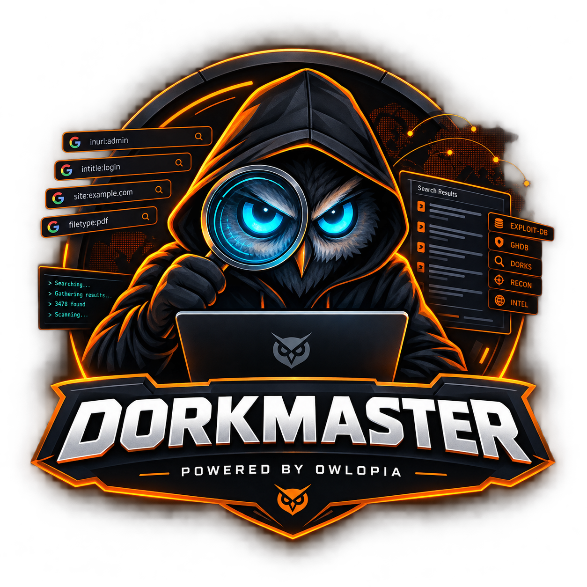

<p align="center">
   
</p>

# DorkMaster 🔍🕶️
> **Automated Google Dorking, OSINT Reconnaissance, and Intelligence Management Tool for Linux, Kali & BlackArch Security Suites.**

<p align="center">
  <a href="https://github.com/infinity-decoder/DorkMaster/releases"></a>
  <a href="https://github.com/infinity-decoder/DorkMaster/stargazers"></a>
  <a href="https://github.com/infinity-decoder/DorkMaster"></a>
  <a href="LICENSE"></a>
</p>

<p align="center">
  Developed with passion by <strong>infinitydecoder</strong> in <strong>Owlopia</strong> 🦉<br/>
  <em>Empowering ethical hackers, security researchers, and OSINT analysts worldwide.</em>
</p>

---

DorkMaster is a high-performance reconnaissance intelligence tool designed for automated Google Dork management, database synchronization, and stealth OSINT execution. Engineered specifically for Debian, Kali Linux, and BlackArch environments, DorkMaster can be executed globally from any terminal path (`dorkmaster`), launched directly from desktop application menus (XFCE, GNOME, KDE, Kali Menu under *Information Gathering*), or installed natively via `.deb` and Arch packages.

---

## 🚀 Key Features

### 📡 Intelligence Gathering
- **Full Database Synchronization**: Reliable scraping of the entire Exploit-DB (GHDB) repository (7,900+ dorks) via high-performance endpoints.
- **Incremental Updates**: Fetch newest daily and weekly dork additions without re-downloading the entire catalog.
- **XDG Base Directory Compliance**: Safely stores local databases in `~/.local/share/dorkmaster/` and logs in `~/.local/state/dorkmaster/`, fully compliant with Linux multi-user standards.

### 🕵️ Stealth Search Engine & Anti-Detection
- **Anti-Bot Mitigation**: Randomized jitter delays and intelligent User-Agent rotation.
- **Proactive 429 Handling**: Automatic detection of rate limiting with IP rotation recommendations (VPN/Proxy).
- **Dual Execution**: Run queries directly in the terminal or automatically pop results into your default web browser.

### 🐧 Native Kali / Debian Desktop & CLI Integration
- **Global Terminal Command**: Once installed, run `dorkmaster` from any directory in the system.
- **Desktop Application Launcher**: Includes Freedesktop `dorkmaster.desktop` standard spec, searchable in Kali Linux under:
  - `01 - Information Gathering`
  - `03 - Web Application Analysis`
- **Scriptable CLI + Interactive TUI**: Run headless one-liners in shell scripts (`dorkmaster --search "sql"`) or enter the full Cyberpunk TUI menu by typing `dorkmaster`.

---

## 📦 Installation & Deployment Options

### Method 1: Install Native Debian / Kali Package (`.deb`)
Download the latest `DorkMaster_v*.deb` package from the [Releases](https://github.com/infinity-decoder/DorkMaster/releases) page:
```bash
sudo dpkg -i DorkMaster_v0.0.3.deb
# Or install with apt dependency resolution:
sudo apt install ./DorkMaster_v0.0.3.deb
```
> **Tip for Kali Linux / Debian users:** If installing from your user home directory shows an `_apt` permission warning (`pkgAcquire::Run (13: Permission denied)`), install directly with `sudo dpkg -i DorkMaster_v*.deb` or copy the file to `/tmp` before running `sudo apt install /tmp/DorkMaster_v*.deb`.

Now run:
```bash
dorkmaster
```

### Method 2: Install on Arch Linux / BlackArch (`.pkg.tar.zst`)
Download the latest `DorkMaster_v*.pkg.tar.zst` package from the [Releases](https://github.com/infinity-decoder/DorkMaster/releases) page:
```bash
sudo pacman -U DorkMaster_v0.0.3.pkg.tar.zst
```
Or build locally via PKGBUILD:
```bash
makepkg -si
```

### Method 3: Install System-Wide via Pip
```bash
git clone https://github.com/infinity-decoder/DorkMaster.git
cd DorkMaster
pip install .
```
Or install in editable mode for development:
```bash
pip install -e .
```

### Method 4: Portable Standalone Runner
```bash
chmod +x run.sh
./run.sh
```

---

## 💻 Command-Line Interface (CLI) Usage

DorkMaster provides both an interactive Cyberpunk dashboard and a scriptable CLI:

```text
usage: dorkmaster [-h] [-v] [-s KEYWORD] [-q DORK] [-b] [-n COUNT] [--sync]
                  [--site DOMAIN] [-p PARAM] [--stats] [--banner]
                  [--data-path PATH]

options:
  -h, --help            Show this help message and exit
  -v, --version         Show program version and exit
  -s KEYWORD, --search KEYWORD
                        Search cached Google dorks by keyword or title
  -q DORK, --query DORK Directly execute a dork query against Google
  -b, --browser         Open search results directly in default web browser
  -n COUNT, --num COUNT Number of results to retrieve (default: 10)
  --sync                Synchronize full Exploit-DB GHDB library into local storage
  --site DOMAIN         Append target site constraint (e.g. --site example.com)
  -p PARAM, --param PARAM
                        Append custom parameter or keyword filter to query
  --stats               Show statistics, last sync timestamp, and storage locations
  --banner              Display the DorkMaster terminal ANSI art banner and exit
  --data-path PATH      Custom path to dorks database JSON file
```

### Quick CLI Examples:

1. **Launch Interactive Cyberpunk Dashboard**:
   ```bash
   dorkmaster
   ```

2. **Search Cached Dorks & Interactively Edit / Add Parameters**:
   ```bash
   dorkmaster --search "jenkins"
   ```
   *Prompts you to select a matching dork, customize parameters (e.g. append `site:target.com` or custom keywords), and choose execution target (Terminal or Web Browser).*

3. **Execute Dork with Target Site Parameter in Terminal**:
   ```bash
   dorkmaster --query 'intitle:"Dashboard [Jenkins]"' --site example.com -n 10
   ```

4. **Execute Query in Live Web Browser**:
   ```bash
   dorkmaster --query "filetype:env DB_PASSWORD" --site example.com --browser
   ```

5. **Sync Full Exploit-DB GHDB Database via Terminal**:
   ```bash
   dorkmaster --sync
   ```

---

## 🎯 Interactive Dork Inspection & Parameter Customizer

When browsing or searching dorks in DorkMaster, selecting any dork opens the **Parameter Modifier & Query Executor**:
- **[1] Append Target Domain / Site**: Automatically applies `site:<domain>`.
- **[2] Append Parameter / Keyword**: Appends custom filters (`filetype:pdf`, `inurl:admin`, `intext:password`).
- **[3] Manually Edit Query String**: Directly refine the query string in real-time.
- **[4] Reset to Original Query**: Reverts modifications back to the original GHDB signature.
- **[T] Execute via Terminal**: Runs OSINT CLI scraping with formatted table output.
- **[B] Execute via Browser**: Launches Google Search directly in the default graphical web browser.

---

## 🎯 Main Interactive Menu Options

1. **Search for Dorks**: Query 7,900+ local dorks by keyword or title.
2. **Check for New Dorks**: Fetch latest additions from GHDB.
3. **Sync Complete GHDB Library**: Initial sync of all Exploit-DB dorks.
4. **Browse Dorks by Category**: Explore organized vulnerability classes.
5. **Quick Execution (Raw Dork)**: Execute arbitrary dorks directly.
6. **View System Statistics**: Inspect database count, last sync date, and paths.
7. **Export Results**: Save output to JSON/CSV.
8. **Terminate Session**: Gracefully exit the application.

---

## ⚖️ Legal & Ethical Disclaimer

**DorkMaster is intended strictly for authorized security research, penetration testing, and educational purposes.**

Unauthorized access, automated querying, or exploitation against targets without explicit, documented permission is illegal under applicable cybersecurity laws. The authors and contributors assume no liability for misuse, damages, or legal consequences arising from this software.

---

## 👥 About

<div align="center">

[](https://github.com/infinity-decoder)
&nbsp;&nbsp;&nbsp;&nbsp;
[](https://github.com/Owlopia)
&nbsp;&nbsp;&nbsp;&nbsp;
[](LICENSE)

<br/>

Developed with passion by [**infinitydecoder**](https://github.com/infinity-decoder) in [**Owlopia**](https://github.com/Owlopia) 🦉  
*Empowering ethical hackers, security researchers, and OSINT analysts worldwide.*

</div>
